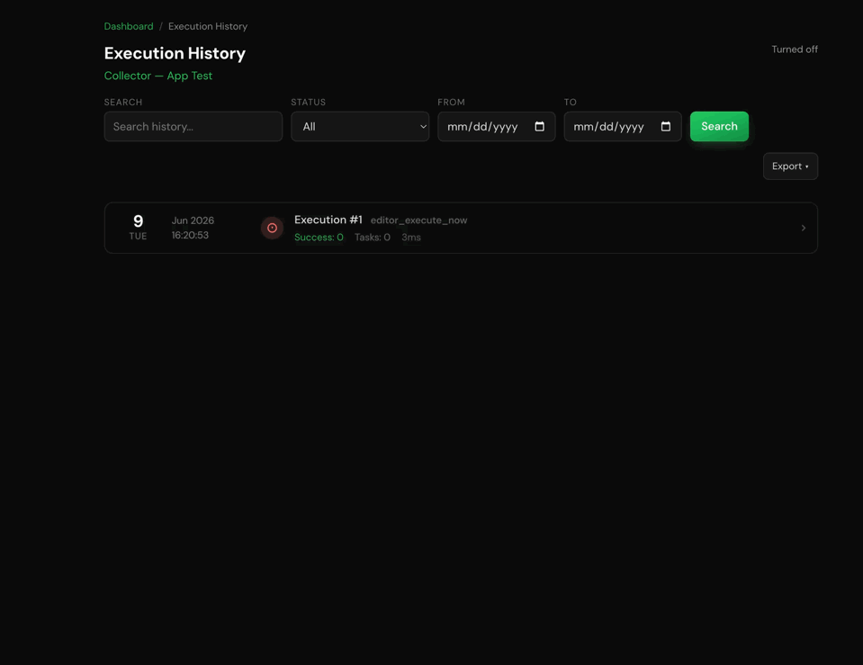

# ShellShot

A macOS menubar app that sends screenshots and short recordings directly into a running Claude Code iTerm2 terminal session. Also supports sending screenshots from an iPad/iPhone on the same WiFi network.

**[⬇ Download for Apple Silicon (v0.1.0)](https://github.com/APIANT/shellshot/releases/latest)** — or [build from source](#install).



## Features

- **⌥⌘C** — area capture, preview, annotate with arrows, send
- **⌥⌘R** — record a region as a frame sequence (perceptually deduped, max 20 frames)
- Session picker across all live Claude Code sessions; preselects the focused one
- "Copy to Clipboard" button copies the annotated capture at full resolution instead of sending
- **iPad/iPhone sharing** — send a screenshot from an iPad or iPhone on the same Wi-Fi into a Mac session via an auto-generated Shortcut
- Images sent to Claude are downscaled to keep token usage reasonable
- Launch at login; captures auto-prune after 7 days

**Supports macOS + iTerm2 only.** tmux, Kitty, and WezTerm adapters are possible.

## Install

Requires macOS 13+ and [iTerm2](https://iterm2.com) with **Settings → General → Magic → Enable Python API**.

### Download (Apple Silicon)

Grab the [latest release](https://github.com/APIANT/shellshot/releases/latest), unzip, and move `ShellShot.app` to `/Applications`. The build is ad-hoc signed (not notarized), so clear Gatekeeper's quarantine once:

```bash
xattr -dr com.apple.quarantine /Applications/ShellShot.app
```

### Build from source

Requires Python 3 (build time only; the app embeds a self-contained sidecar).

```bash
git clone https://github.com/APIANT/shellshot ~/shellshot
cd ~/shellshot
python3 -m venv prototype/.venv
prototype/.venv/bin/pip install iterm2 pyinstaller
./app/build-app.sh
open /Applications/ShellShot.app
```

macOS will prompt once for Screen Recording and once for iTerm2 automation. The installed app is self-contained.

## iPad/iPhone sharing

Send a screenshot from an iPad or iPhone (on the same Wi-Fi as the Mac) into a Claude Code session:

1. In the ShellShot menu, enable **iPad Sharing**, then choose **Set Up iPad Shortcut…** — a QR code appears with the Mac's address and a token baked in.
2. On the device, point the Camera at the QR code, tap the banner, and **Add Shortcut**.
3. To use it: take a screenshot, tap **Share**, and pick **ShellShot**. Choose which Claude session to send to (the focused one is marked ●), add an optional message, and it posts to the Mac.

The Mac runs a small token-guarded HTTP listener (port 8472) for this; it's off by default and LAN-only. Images are downscaled the same way as local captures.

## License

MIT © APIANT Inc.
